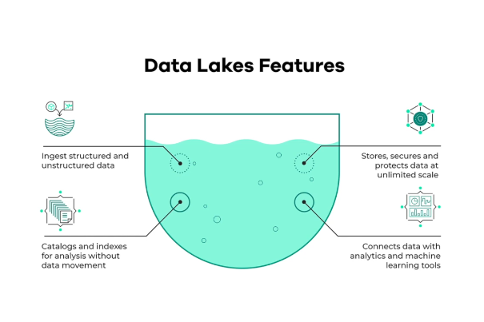

# Data Lake (GCS)
## What is a Data Lake?
A data lake is a centralised storage repository for storing big data from many sources in its raw or native format. Data stored in a data lake can be structured, semi-structured, or unstructured. A data lake solution generaly has to be secure, scalable and inexpensive

## Data Lake vs. Data Warehouse
|                  |Data Lake                             |Data Warehouse                    |
|------------------|------------------------------------  |----------------------------------|
|**Data Structure**|Generally contains unstructured, raw data|Generally contains structured, processed data|
|**Target Users**  |Data Analysts/Scientists              |Business Analysts                 |
|**Use Cases**     |Stream Processing, Machine Learning, Real-Time Analytics|Batch Processing, BI Reporting|
|**Storage size**  |Huge amount of data, usually petabytes|Relatively Small|          
|**Purpose of Storage**|Not yet defined|Defined and already in use|

## How did it start?
* James Dixon, the then chief technology officer at Pentaho coined the term in 2011. ([source](https://en.wikipedia.org/wiki/Data_lake))
* It started due to companies realising more about the value of data and how the traditional Data Warehouse structure hindered the ability to store and access data quickly as developing schemas and relationships takes time.
* Also, it was discovered that data might not seem useful when the project starts but later in the project lifecycle.
* Once cannot always define the structure of data, hence a Data Warehouse might not be possible.
* Increase in Data Scientists and increase in Research and Development on Data Products also brought about its popularity.
* Another driver of Data Lake solutions was the need for cheap storage of Big Data.

## ETL vs ELT
* **ETL** represents **E**xtract, **T**ransform and **L**oad while **ELT** represents **E**xtract, **L**oad and **T**ransform. These two concepts might seem very similar but it is a good example of what differentiates a Data Lake from a Data Warehouse.
* ETL is a Data Warehouse solution. It's idea is *schema-on-write*: schema and relationships have to be defined before the data is written.
* ELT is a Data Lake soluition. IT's own idea is *schema-on-read*: data is written first, then the schema is determined on the read.

## Gotchas (Challenges) of Data Lake
