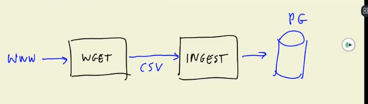
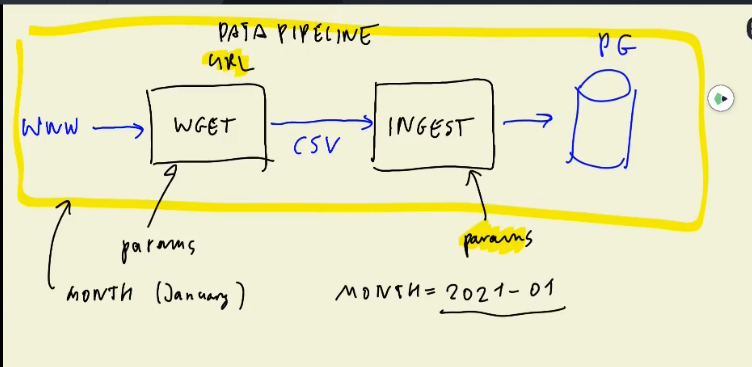
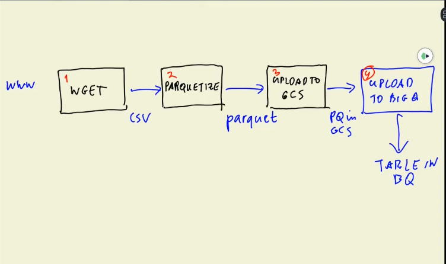
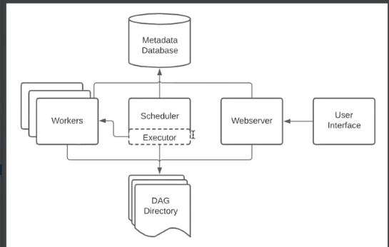

# Data Lake (GCS)
## What is a Data Lake?
A data lake is a centralised storage repository for storing big data from many sources in its raw or native format. Data stored in a data lake can be structured, semi-structured, or unstructured. A data lake solution generaly has to be secure, scalable and inexpensive


## Data Lake vs. Data Warehouse
|                  |Data Lake                             |Data Warehouse                    |
|------------------|------------------------------------  |----------------------------------|
|**Data Structure**|Generally contains unstructured, raw data|Generally contains structured, processed data|
|**Target Users**  |Data Analysts/Scientists              |Business Analysts                 |
|**Use Cases**     |Stream Processing, Machine Learning, Real-Time Analytics|Batch Processing, BI Reporting|
|**Storage size**  |Huge amount of data, usually petabytes|Relatively Small|          
|**Purpose of Storage**|Not yet defined|Defined and already in use|

## How did it start?
* James Dixon, the then chief technology officer at Pentaho coined the term in 2011. ([source](https://en.wikipedia.org/wiki/Data_lake))
* It started due to companies realising more about the value of data and how the traditional Data Warehouse structure hindered the ability to store and access data quickly as developing schemas and relationships takes time.
* Also, it was discovered that data might not seem useful when the project starts but later in the project lifecycle.
* Once cannot always define the structure of data, hence a Data Warehouse might not be possible.
* Increase in Data Scientists and increase in Research and Development on Data Products also brought about its popularity.
* Another driver of Data Lake solutions was the need for cheap storage of Big Data.

## ETL vs ELT
* **ETL** represents **E**xtract, **T**ransform and **L**oad while **ELT** represents **E**xtract, **L**oad and **T**ransform. These two concepts might seem very similar but it is a good example of what differentiates a Data Lake from a Data Warehouse.
* ETL is a Data Warehouse solution. It's idea is *schema-on-write*: schema and relationships have to be defined before the data is written.
* ELT is a Data Lake soluition. IT's own idea is *schema-on-read*: data is written first, then the schema is determined on the read.

## Gotchas (Challenges) of Data Lake
* Using a Data Lake starts with a good intention, but it can soon turn into a **Data Swamp**
* This is due to lack of organisation, versioning, incompatible schemas for same data.
* It also can occur when there is no metadata associated with the data in the Data Lake
* When _joins_ become impossible, Data Lakes become useless.
* When a Data Lake converts into a Data Swamp, it becomes hard to be useful by Data Scientists and Analysts.

## Cloud Providers For Data Lakes
* **G**oogle **C**loud **P**latform: Cloud Storage
* **A**mazon **W**eb **S**ervices: S3
* AZURE: Azure Blob

## For More Info:
* [Wikipedia](https://en.wikipedia.org/wiki/Data_lake)
* [2011 Aricle on Data Lake](https://www.forbes.com/sites/ciocentral/2011/07/21/big-data-requires-a-big-new-architecture/?sh=39f64fdc1157)
* [Data Lake vs Data Warehouse](https://www.talend.com/resources/data-lake-vs-data-warehouse/)
* [Turning Your Data Lake Into a Data Swamp](https://www.integrate.io/blog/turning-your-data-lake-into-a-data-swamp/)

# Introduction to Workflow Orchestration
We made a kind of pipleline last week, [ingest_data.py](https://github.com/Isaac-Tolu/data-engineering-zoomcamp/blob/main/week1/2_docker_sql/dockerfiles/ingest_data.py). This script downloaded a csv file, did some processing and ingested it to Postgres. It got data as input, and produced data as output


This is a good example of how we should _not_ write data pipelines. The reason is because we're doing two different operations in one script. If something happened during the ingesting process (e.g. connection error to Postgres), running the script again means re-downloading the csv file. Different operations should be splitted into multiple files



The data pipeline is parameterized. The different jobs have parameters and the pipeline as a whole also has a parameter (URL). The parameter of the pipeline can even be time e.g. running the whole pipeline on 2022-01-31.



This week, we're doing a much more interesting and complex architecture:
* Download the CSV file,
* Convert it to a parquet file. A parquet file is much more efficient than a CSV file, as it uses a columnar storage format. Additional information about Parquet file is [here](https://dzone.com/articles/how-to-be-a-hero-with-powerful-parquet-google-and)
* Upload the parquet file to Google Cloud Storage
* Upload to BigQuery from GCS

The final result would be a table in BigQuery



A data pipeline is often called a data workflow. It is also sometimes referred to as **DAG** (**D**irected **A**cyclic **G**raph):
* Directed because it has a direction, 
* Acyclic because it does not work in cycles i.e. as a loop, 
* Graph because the boxes are the nodes and arrows define dependencies.

We use orchestration tools to manage this workflow. A traditional way can be through the use of python scripts and the [MAKE](https://www.gnu.org/software/make/) utility to define dependencies.This is usually used for smaller workflows.

There are standard tools created specifically for managing data workflows. Some of them are:
* [Luigi](https://luigi.readthedocs.io/en/stable/)
* [Apache Airflow](https://airflow.apache.org/)
* [Prefect](https://www.prefect.io/)
* [Argo](https://argoproj.github.io/)

Apache Airflow is the most popular tool used, and that is what we'll be focusing on in this course.

# Setting up Airflow Environment with Docker-Compose


The airflow architecture consists of a:
- _Webserver_ which is a handy GUI to inspect, trigger and debug the behaviour of dags and tasks. It is available on localhost 8080,
- _Scheduler_, a component responsible for scheduling jobs, it handles both triggering and schedule workflows, submits tasks to the executor to be ran, monitors all tasks and dags, and then triggers the task consensus once their dependencies are met,
- _Worker_, a component that executes the task given by the scheduler
- _Metadata Database_, a backend to the airflow environment. It is used by the scheduler, executor and webserver to store the state of the environment

> **Difference between Executor and a Worker**  
The _Executor_ is the mechanism which gets tasks executed while the _Worker_ is a node or processor that runs the actual tasks. More info [here](https://towardsdatascience.com/a-gentle-introduction-to-understand-airflow-executor-b4f2fee211b1#:~:text=What's%20Airflow%20Executor,-There%20are&text=The%20discipline%20%E2%80%9CExecutor%2C%E2%80%9D%20fittingly,tasks%20over%20to%20the%20Executor.)

There are other components in the docker-compose services which are optional:
- A _Redis_ service, which is a message broker that forwards messages from the scheduler to the worker
- _Flower_, for monitoring the environment, available at localhost 5555 by default
- _airflow_init_, an initialisation service that initialises the configuration such as backend, user credentials, environment variables

## Pre-setup
- Rename the service account key that we downloaded last week to `google_credentials.json`, and store it in the path. `$HOME/.google/credentials/`. This is to maintain standardisation across our workshop setup:
```ssh
cd ~ && mkdir -p ~/.google/credentials
mv <path/to/your/service-account-authkeys>.json ~/.google/credentials/google_credentials.json
```
- You may need to upgrade the docker-compose version to v2.0+ and set the memory of the Docker Engine to a minimum of 5GB (ideally 8GB), because if enough memory is not allocated, it might cause airflow-webserver to continuously restart. You can check amount of memory using this command:
```ssh
docker run --rm "debian:buster-slim" bash -c 'numfmt --to iec $(echo $(($(getconf _PHYS_PAGES) * $(getconf PAGE_SIZE))))'
```

## Airflow Setup
- Create a new subdirectory called `airflow`
- Import the official image and setup from latest airflow version on the Airflow site or run this command:
```ssh
curl -LfO 'https://airflow.apache.org/docs/apache-airflow/2.2.3/docker-compose.yaml'
```
- The contents of the `docker-compose.yaml` file can be overwhelming, there is also a [no-frills](./airflow/extras/docker-compose-nofrills.yaml) version which only contains the web-server. All other services would then be initialised from the webserver. We'd stick with the former.
- Create empty folders for `dags`, `logs`, and `plugins`
```ssh
mkdir -p ./dags ./logs ./plugins
```
- Set the airflow user, otherwise the files created in `dags`, `logs` and `plugins` will be created with root user
```ssh
echo -e "AIRFLOW_UID=$(id -u)" > .env
```
- If we run the original docker-compose file, it will run but it will not work in a GCP environment. We would have to build a custom Dockerfile to account for that. This would require us to edit the `build` part of the original docker-compose file.
- Also, we'll need to create a `requirements.txt` file to install libraries via pip install:
    - `apache-airflow-providers-google`: Google specific client for airflow
    - `pyarrow`: For conversion of CSV to parquet files.

## Execution
- We build the docker image
```ssh
docker-compose build
```
- Initialise the airflow scheduler, DB and other configs
```ssh
docker-compose up airflow-init
```
This helps in authenticating your UID in order to interact with the webserver, sets other environment variables, sets up the backend (metadata database), airflow credentials etc.
> This is not a production setup, that is why the username and password is airflow
- Kick up all other services with:
```ssh
docker-compose up
```

# Ingesting Data to GCP with Airflow
We'll be covering the anatomy of DAGs, typical workflow components, and we'll be writing our own ingestion pipeline

There are 4 main components to a workflow:
- **DAG (Directed Acyclic Graph)**, specifies dependencies between tasks and has an explicit execution order. It also has a beginning and an end 
- **Task**, defined unit of work. It is also known as opeators in airflow. The tasks define what to do
- DAG run: Individual execution of the run of a a DAG
- **Task Instance**: Individual run of a single task. They have an indicator of state e.g. `running`, `success`, `up_for_retry`, `failed`, `skipped` etc.
> Ideally, a task should flow from `none` to `scheduled` to `queued` to `running` to `success`

An airflow DAG id defined in a python file composed of:
- **DAG definition**, we define a DAG using the `with` context manager. There are other ways to do this.
- **Task**, usually come in the form of operators, sensors or task flows.
- **Dependencies**, task dependencies are responsible for control flow within a DAG.